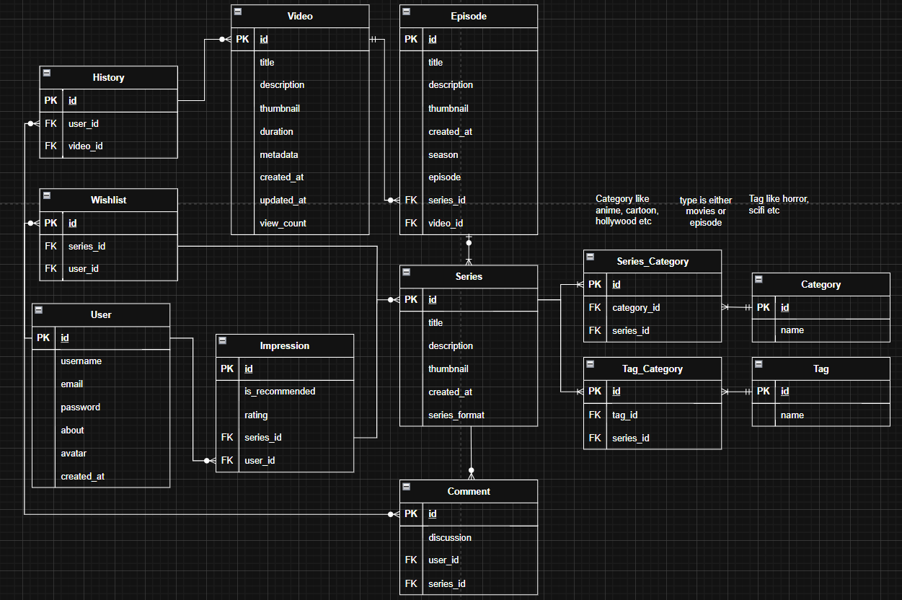

# MOVIE LIKE ASPCORE NET

A Movie/Series API - Or whatever platform it'll be in the end of development

## Tech Stack

- **ASP.NET Core** 9.0.0
- **C#** 13
- **Docker** 28.0.4

## API Access

- http://aimanafiq.runasp.net/api/{REST_ENDPONT}

## Migrate

1. Enter the API folder path

```bash
cd api
```

2. Initiate migration

```bash
dotnet ef migrations add Init
```

## Local Installed MSSQL

If you don't want to use docker follow these steps:

1. Install MSSQL in your OS platforms and edit your own appsettings.Development.json to match your configuration

2. Create you database name, in this example I use movieaspcore.

3. Try connecting to SQL server

```bash
dotnet watch run
```

4. if it works, run database update

```bash
dotnet ef database update
```

## Docker Access [RECOMMENDED]

1. If you use windows, please install WSL and Docker Desktop, and run Docker Desktop
2. If you use Linux or Mac, please install docker and docker compose v2

Docker

- please find way to install, there are many options like apt, .deb if I am not mistaken

Docker Compose V2

```bash
sudo apt install docker-compose-v2
```

3. Run docker build command

```bash
docker compose up --build
```

4. Your API should already started

5. Tips if it works, you would get something like

if you do

```bash
docker volume ls
```

DRIVER VOLUME NAME
- local movie-like-aspcore_sqlserver_data
- local movie-like-aspcore_uploads_data

and if you do

```bash
docker ps -a
```

CONTAINER ID IMAGE COMMAND CREATED STATUS PORTS NAMES
- id here movie-like-aspcore-api "dotnet api.dll" About an hour ago Exited (0) 25 minutes ago movie-like-aspcore-api-1
- id here mcr.microsoft.com/mssql/server:2022-latest "/opt/mssql/bin/laun…" About an hour ago Exited (137) 25 minutes ago movie-like-aspcore-sqlserver-1

### REST ENDPOINT

- series - Full CRUD support
- categories - No UPDATE support
- tags - No UPDATE support
- episode/id - No UPDATE support
- video/id - No UPDATE, READ ALL
- user - Register, Login
- comments - No UPDATE support

### Instructions using POSTMAN

Put URL at front.

If you are using localhost follow the Docker Access instructions and put localhost:9260

- for example, localhost:9260/api/series

if you are using the API access, put http://aimanafiq.runasp.net/api/

- for example, http://aimanafiq.runasp.net/api/series

Maybe I will do ui for all my api later........ with Laravel.

but for now
[Click here to view the API](https://www.postman.com/payload-specialist-8137764/workspace/aimanafiq-work-s/folder/33511040-72e75469-3896-4900-8e6a-b7420b139c01?action=share&creator=33511040&ctx=documentation&active-environment=33511040-bfecc31f-3951-40c2-9d95-753e310ce5b9)

## Screenshots

- None at the moment, lack of frontend works.

### Erd

<div>
  
</div>
