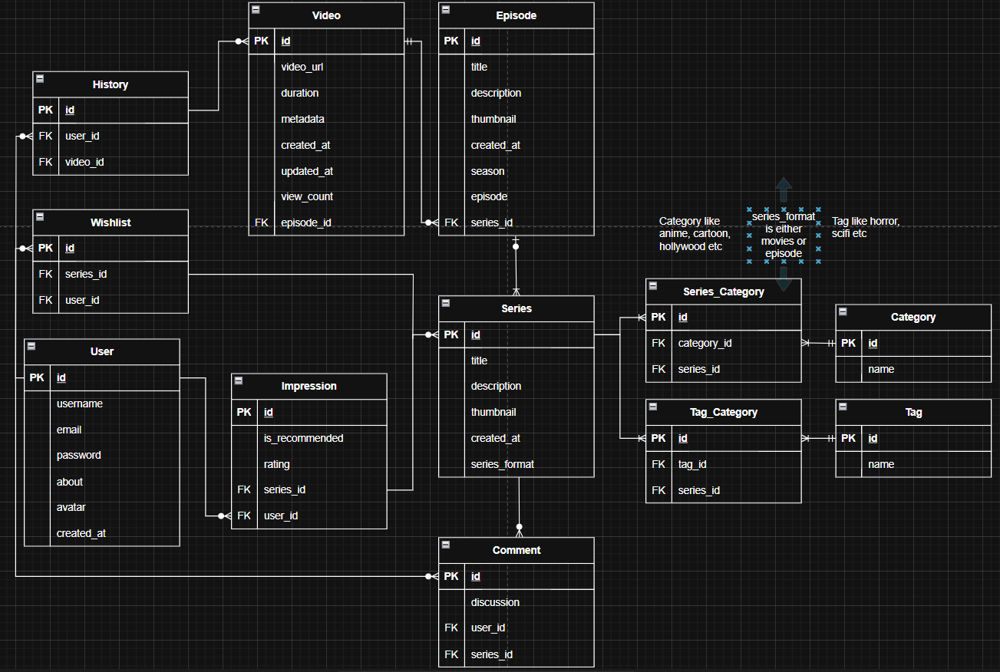

# 📇 MOVIE LIKE ASPCORE NET

A Movie/Series API - currently in Development

## ✨ Tech Stack

- **ASP.NET Core** 9.0.0
- **C#** 13.0

## API Access

- http://aimanafiq.runasp.net/api/{REST ENDPONT}

### REST ENDPOINT

- series - Full CRUD support
- categories - No UPDATE support
- tags - No UPDATE support
- episode/id - No UPDATE support
- video/id - No UPDATE, READ ALL support

### Instructions

- Read, Update, Delete ID needs to pass id like for example /api/{id}

## Screenshots

### Erd

  

